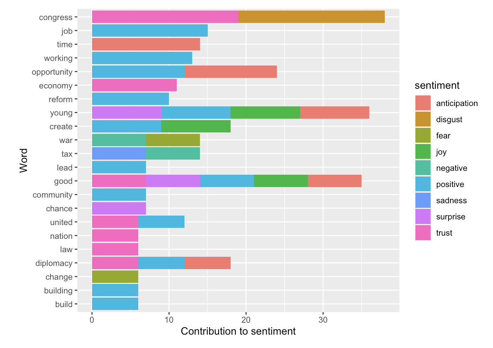

---

## Data Science Projects

### Code-Throughs

[**Sentiment Analysis**](cpp-527-code-through-Ronning.html)

This code-through covers various text and sentiment analysis options in both the **quanteda** and **tidytext** packages. We use the 2014 State of the Union Address that President Barack Obama delivered in order to analyze the words used most frequently, as well as the senntiments those words elicited.

[**Connection Map**](cpp-529-code-through-Ronning.html)

This code-through walks through how to create a basic Connection Map, while also providing more advanced options to make your map unique. While there are many methods to uploading maps in R, the **maps** and **leaflet** packages are two of the most accessible for completing the task.

[**Lollipop Plots**](cpp-526-code-through-Ronning.html)

This code-through explores how to create various lollipop plots using the **ggplot2** package in R.

### Dashboards

**Denver**

[**City of Tempe Dashboard**](https://kirstenronning.shinyapps.io/CityofTempeDashboard/#section-day-and-time)

This dashboard was created using the City of Tempe Open Data Portal. It explores connections between Day and Time of the crash and Age and Substance Abuse presence, while also allowing to analyze characteristics and draw Comparisons of the drivers involved in the crash.

---

## Capstone Project

[**Honors Thesis: Attitudes and Experiences with Period Poverty at Arizona State University**](Ronning_K_Spring_2020.pdf)

In recent years, feminist activists have taken their fascination and concern over access to period products in developing countries and diverted their attention to period poverty that exists in the United States. Backed by globalist approaches and the deep history of Menstrual Activism in the US, the Menstrual Equity Movement aims to make policy changes at the state and federal levels to ensure that all menstruators have the products they need to manage menstruation. This exploratory study aims to understand the experiences and attitudes about period poverty at Arizona State University’s campus. Undergraduate menstruators were asked to reflect on general and on campus experiences with access to period products. Quantitative and qualitative analyses were utilized in conducting this research. This study concludes that menstruators’ education would benefit from having access to free period products in all bathrooms. 

Keywords: menstrual equity, period poverty, menstrual activism, period products

<style>
  
  .gs-section-01 h3 { }
  
  .gs-section-01 p {
   }
   
  .gs-section-01 img {
    border: 1 px solid #ddd;
    border-radius: 4px;
    padding: 5px;
    width: 150px;
   }
   
   
